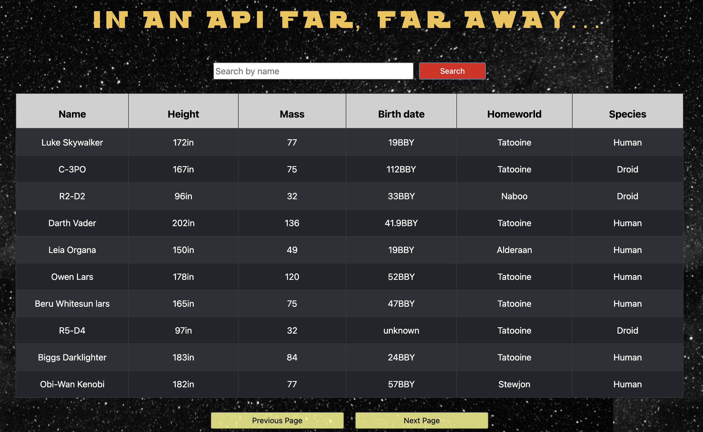

# Star Wars API Character Guide

Check out the project [here](https://star-wars-character-api.netlify.app/)!

## Description

This is the first time I have create a react project using an API!

Creating this project, helped me better understand the structure of a react project and clarified some react fundamentals that I wasn't completely comfortable with in my last project.
For awhile I did struggle to figure out how I would access the "next" and "previous" pages of character data and how I would pass that data to a unique component for that pagination feature. Then I remembered state! Once I created a state for each instance that the data would need to be requested or changed, the project flowed much smoother!

What I learned

- Retreiving and handling data from API requests
- Rendering API data to a Table
- Component structuring
- Bootstrap

Star Wars API Site Functionality :

- Renders 10 Character Data rows per page, using the star wars API
- Able to search for a character by their name
- Go navigate to the Next or Previous page from buttons below the table
- Text renders on screen when data is being fetched

## Author

Kurtis Casperson, Software Developer
connect with me on [LinkedIn](https://www.linkedin.com/feed/) !
